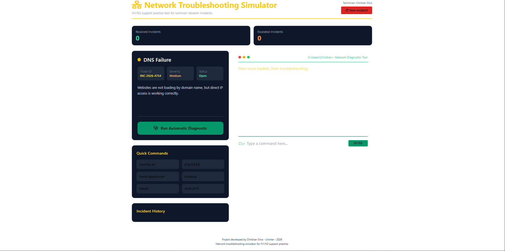

# 🌐 Network Troubleshooting Simulator

## Practical IT Support Workflow Simulation

A front-end project focused on network troubleshooting, incident handling, diagnostic steps, escalation, and resolution workflows commonly used in IT Support, Service Desk, Help Desk, and Technical Support environments.

This project simulates a support dashboard where incidents can be created, analyzed, escalated, and resolved through an interactive interface.

---

## 🚀 Live Demo

[Access the Live Demo](https://silvasupportsolutions.github.io/Network-Troubleshooting-Simulator/)

## 📂 GitHub Repository

[View Repository](https://github.com/SilvaSupportSolutions/Network-Troubleshooting-Simulator)

---

# 🎯 Project Purpose

The main goal of this project is to demonstrate practical troubleshooting logic, technical support reasoning, and workflow organization.

It was designed to show how a support analyst can structure an incident from the first report to the final resolution.

---

# ⚙️ Features

- Create a new network incident
- Run automatic diagnostics
- Simulate troubleshooting status updates
- Escalate incidents when needed
- Resolve incidents through a support workflow
- Display activity and troubleshooting logs
- Responsive dashboard interface
- Practical IT Support simulation

---

# 🧠 Simulated Support Workflow

1. New incident is created
2. Diagnostic process is started
3. System analyzes the issue
4. Incident can be escalated
5. Resolution is applied
6. Final status is updated

---

# 🛠️ Technologies Used

- HTML5
- CSS3
- JavaScript

---

# 🖼️ Project Screenshots

## 1. Home Dashboard

---

## 2. New Incident

---

## 3. Diagnostic Running

---

## 4. Incident Escalated

---

## 5. Resolved Incident

---

# 📌 Common Simulated Issues

- Network instability
- DNS failure
- Gateway communication issue
- Packet loss
- Slow network response
- Service interruption
- Incident escalation scenario

---

# 🔧 Future Improvements

- Add ticket priority levels
- Add incident categories
- Add simulated command-line diagnostics
- Add exportable incident reports
- Add dashboard statistics
- Add dark/light mode
- Add user authentication simulation

---

# 👤 Author

**Christian F.**  
IT Support | Technical Support | Service Desk | AI Quality

[LinkedIn Profile](https://www.linkedin.com/in/christianftech/)  
[GitHub Profile](https://github.com/SilvaSupportSolutions)
